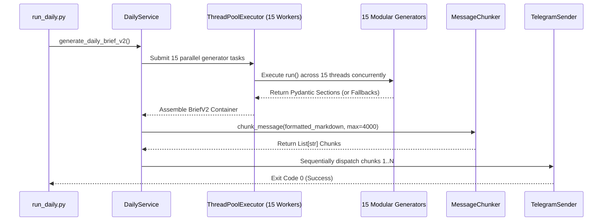

# PracticePhoenix v2.0: Modular N-Tier Generator Architecture

## Overview
PracticePhoenix v2.0 transitions the generator architecture from a consolidated 8-section engine into a highly decoupled, wave-parallel **15-Generator N-Tier Subsystem**. Every section of the redesigned morning ritual is managed by an independent generator class adhering to strict single-responsibility principles, deterministic JSON output formatting (`response_format={"type": "json_object"}`), and isolated fallback containment.

---

## 1. Architectural Blueprint & Class Hierarchy

```mermaid
classDiagram
    class BaseGenerator~T~ {
        +Path template_path
        +Type~T~ target_model
        +AIGenerator ai
        +ResponseParser parser
        +generate(fallback: T, **kwargs) T
    }

    class NewsGenerator {
        +run() NewsSection
    }
    class ReadAloudGenerator {
        +run() ReadAloudSection
    }
    class ExecutiveGenerator {
        +run(topic: str) ExecutiveSection
    }
    class HRGenerator {
        +run(category: str) HRSection
    }
    class OSGenerator {
        +run(topic: str) CSDeepDiveSection
    }
    class DBMSGenerator {
        +run(topic: str) CSDeepDiveSection
    }
    class NetworksGenerator {
        +run(topic: str) CSDeepDiveSection
    }
    class LinuxGenerator {
        +run(topic: str) CSDeepDiveSection
    }
    class SQLGenerator {
        +run(topic: str) CSDeepDiveSection
    }
    class BackendGenerator {
        +run(topic: str) BackendDeepDiveSection
    }
    class AIGenerator {
        +run(topic: str) AIDeepDiveSection
    }
    class DSAGenerator {
        +run(topic: str) DSASection
    }
    class SystemDesignGenerator {
        +run(topic: str) SystemDesignSection
    }
    class RevisionGenerator {
        +run() RevisionSection
    }
    class MissionGenerator {
        +run() MissionSection
    }
    class CoachGenerator {
        +run(metrics: dict) CoachSection
    }

    BaseGenerator <|-- NewsGenerator
    BaseGenerator <|-- ReadAloudGenerator
    BaseGenerator <|-- ExecutiveGenerator
    BaseGenerator <|-- HRGenerator
    BaseGenerator <|-- OSGenerator
    BaseGenerator <|-- DBMSGenerator
    BaseGenerator <|-- NetworksGenerator
    BaseGenerator <|-- LinuxGenerator
    BaseGenerator <|-- SQLGenerator
    BaseGenerator <|-- BackendGenerator
    BaseGenerator <|-- AIGenerator
    BaseGenerator <|-- DSAGenerator
    BaseGenerator <|-- SystemDesignGenerator
    BaseGenerator <|-- RevisionGenerator
    BaseGenerator <|-- MissionGenerator
    BaseGenerator <|-- CoachGenerator
```



---

## 2. Pydantic v2.0 Contract Definitions (Target Schemas)

Every generator targets a specific Pydantic schema enforcing flat markdown strings to prevent nested JSON parsing anomalies:

```python
class NewsSection(BaseModel):
    headline: str
    why_care: str
    interview_relevance: str

class ReadAloudSection(BaseModel):
    paragraph: str
    pronunciation_words: List[str]
    speaking_challenge: str

class HRSection(BaseModel):
    question: str
    why_asked: str
    star_situation: str
    star_task: str
    star_action: str
    star_result: str
    common_mistakes: str
    practice_task: str

class CSDeepDiveSection(BaseModel):
    topic: str
    question: str
    why_asked: str
    ideal_answer: str
    deep_dive: str
    production_example: str
    common_mistake: str
    follow_up: str

class SystemDesignSection(BaseModel):
    scenario: str
    trade_offs: str
    architecture_blueprint: str

class MissionSection(BaseModel):
    checklist_items: List[str]
    estimated_minutes: int = 25
    difficulty_rating: str = "⭐⭐⭐⭐ (Advanced)"
```

---

## 3. Orchestration & Wave-Parallel Execution

To assemble the 15 independent sections within acceptable runtime bounds (`<20 seconds` wall clock), `DailyService` employs a multi-wave `ThreadPoolExecutor(max_workers=15)` orchestration pipeline:



---

## 4. Isolation & Guaranteed Fallback Boundaries

A critical requirement of PracticePhoenix v2.0 is zero cascading failure propagation. If an upstream AI gateway encounters rate limiting or latency spikes during `AIGenerator.run()`, the system must never drop the entire morning brief.

### Isolation Protocol
1. **Thread-Level Exception Trapping**: Every future submitted to `ThreadPoolExecutor` is wrapped in an isolated boundary evaluator (`_safe_resolve_v2(future, fallback_instance, label)`).
2. **Timeout Enforcement**: A hard timeout of `45 seconds` is applied per thread resolution.
3. **Deterministic Fallback Injection**: If a timeout or `ValidationError` occurs, the resolver catches the exception, logs a warning checkmark (`✓ AI generated (fallback)`), and returns a pre-compiled, high-signal fallback Pydantic object.
4. **Guaranteed Delivery**: `DailyService` is mathematically guaranteed to return a fully populated `BriefV2` instance under all network conditions.
