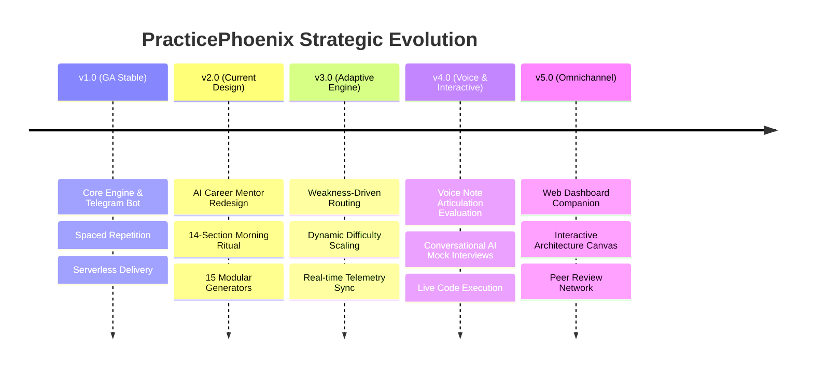

# PracticePhoenix v2.0: Product Vision & Strategic Blueprint

## Executive Summary
PracticePhoenix v2.0 marks an evolutionary transition from a static technical daily brief generator into an autonomous, personalized **AI Career Mentor**. Designed specifically for ambitious software engineers preparing for top-tier (FAANG+) technical interviews and executive engineering leadership roles, PracticePhoenix v2.0 provides structured, compounding daily Socratic mentorship delivered directly via mobile Telegram notifications.

---

## 1. Mission Statement
> **"To transform ambitious software engineers into elite, interview-ready technical leaders through compounding daily momentum, high-signal architectural rigor, and personalized Socratic mentorship."**

PracticePhoenix bridges the gap between passive tutorial consumption and active interview mastery by integrating daily technical synthesis, verbal communication practice, behavioral interview preparation, and spaced repetition recall into a unified 25-minute morning ritual.

---

## 2. Target Audience
PracticePhoenix v2.0 is tailored for three distinct tiers of engineering professionals:
1. **Mid-Level Engineers (2–5 YOE)**: Targeting Senior Software Engineer (L5/E5) roles who need deep systems architecture intuition and structured behavioral framing.
2. **Specializing Engineers**: Backend or Full-Stack developers transitioning into high-growth AI Systems Engineering, LLM Infrastructure, or Distributed Systems roles.
3. **Senior Engineering Leads (5+ YOE)**: Time-constrained technical leaders maintaining sharp coding interview readiness, architectural trade-off fluency, and executive communication polish.

---

## 3. Core Philosophy
The platform operates on four foundational pillars:
- **Compounding Daily Momentum (1% Better Every Day)**: Consistent, manageable 25-minute study sessions yield exponentially greater long-term retention than sporadic multi-hour cramming sessions.
- **Production Realities Over Academic Theory**: Every technical explanation must address real-world failure modes, scale constraints, memory budgets, and architectural trade-offs rather than textbook definitions.
- **Socratic Active Recall**: Learning occurs through active struggle and verbal articulation. PracticePhoenix challenges users to explain complex systems from memory before presenting answers.
- **Holistic Engineering Excellence**: True engineering leadership requires equal mastery of Data Structures, Distributed Systems, Behavioral Framing (STAR), and Executive Articulation.

---

## 4. Success Metrics (KPIs)
To evaluate product efficacy, PracticePhoenix v2.0 tracks primary user engagement and learning outcomes:
- **Morning Ritual Retention Rate**: Percentage of active users maintaining a `>= 7-day` consecutive study streak (Target: `> 85%`).
- **Session Completion Rate**: Percentage of delivered daily briefs where the user marks all interactive review tasks completed within 24 hours (Target: `> 75%`).
- **Spaced Repetition Recall Accuracy**: User self-reported mastery score during automated spaced repetition loops (Target: `> 80%` successful recall).
- **Time-to-Interview Readiness**: Average study duration required for candidates to pass mock technical screening rounds (Target: `< 60 days` of consistent daily practice).

---

## 5. User Personas

### Persona 1: "Aspirant Anya" (Mid-Level Backend Developer)
- **Background**: 3 years of experience writing Java/Spring Boot microservices at a mid-sized fintech company.
- **Goal**: Clear L5 Senior Software Engineer loops at Google or Meta within 4 months.
- **Pain Points**: Overwhelmed by broad system design requirements; struggles to articulate architectural trade-offs concisely under interview pressure.
- **How v2.0 Helps**: Delivers daily micro-system design scenarios, forces structured trade-off evaluation, and provides STAR behavioral practice.

### Persona 2: "Transitioning Tara" (Full-Stack Engineer -> AI Systems)
- **Background**: 5 years of experience building TypeScript/Node.js web applications.
- **Goal**: Pivot into an AI Infrastructure or LLM Engineering role at an AI research lab or hyper-growth startup.
- **Pain Points**: Lacks formal mathematical intuition for Transformer architectures, inference optimization (KV caching, quantization), and GPU memory management.
- **How v2.0 Helps**: Provides daily dedicated AI Engineering deep-dives focusing on production deployment realities and LLM scaling trade-offs.

### Persona 3: "Busy Bob" (Staff Engineer & Technical Lead)
- **Background**: 8 years of experience managing core billing infrastructure.
- **Goal**: Maintain peak technical interviewing sharpness while leading a team of 10 engineers, with less than 30 minutes of free time daily.
- **Pain Points**: Zero time for long textbooks or video courses; needs high-signal executive vocabulary and rapid algorithmic pattern refreshers during his morning commute.
- **How v2.0 Helps**: 25-minute mobile Telegram morning ritual delivered at exactly 07:00 IST with zero filler and audio speaking challenges.

---

## 6. Strategic Future Roadmap

### Phase Vision Breakdown
- **v2.0 (AI Career Mentor)**: Complete product design redesign expanding the daily brief into a holistic 14-section executive mentoring experience.
- **v3.0 (Adaptive Personalization Engine)**: Deep coupling between activity telemetry and prompt generation, automatically adjusting topic complexity and revision frequencies based on user error patterns.
- **v4.0 (Voice & Articulation Mode)**: Integration of Telegram voice notes where users record spoken interview answers evaluated in real-time by AI audio parsers for clarity, pacing, and confidence.
- **v5.0 (Omnichannel Web Companion)**: A dedicated React/Next.js web application providing interactive visual graph representations of user knowledge domains and live system design whiteboarding.
